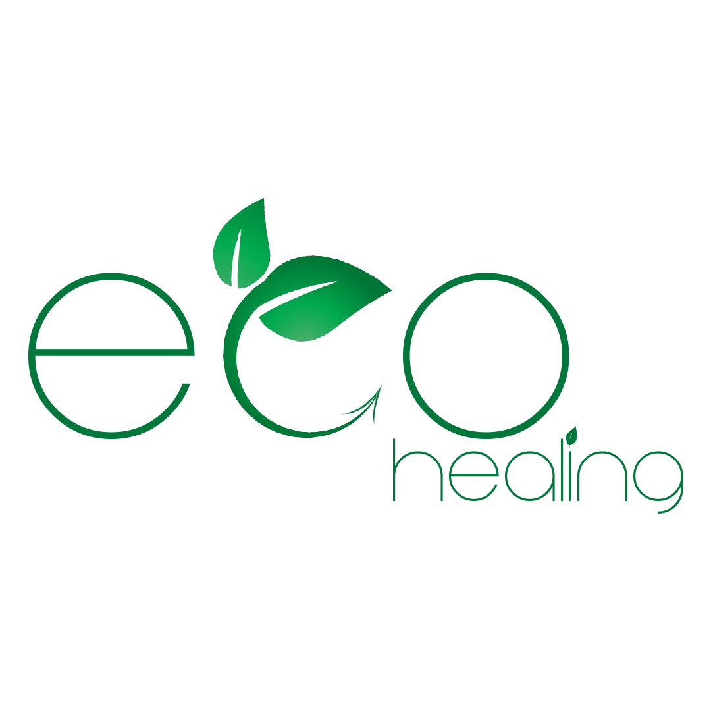

# Eco Healing: Onestop marketplace for reduce and reuse waste

Eco-Healing is going to provide a single platform for two different users, where user can react as a buyer/rental/taker or user can react as a seller/Lessees/donor. Eco-Healing is going to promote environment healing and reduce the carbon emission by stopping the wastage of food/cloth/E-waste that different sectors and peoples do in their day-to-day life. User can share the items photo with detailed descriptions like expiry date for food, category, and sub section of items with its recent condition.

Here both type of users can interreact with each other using in build chat application where they can confirm the items which they want and share their secluded location where they can meet and achieve the items. Here both users will also get their confirmations like order placed and order confirmation for taker and uploader, respectively.

Eco-Healing platform will provide an innovative solution without any security breach and support the peoples and community who want to help the environment as well as aware the one who do not. This application will also help the ones who are really in need and do not have any food to eat, proper cloth to buy and electronic items.

Trello Scrum Board: https://trello.com/b/6Mf8vpo0/eco-healing
